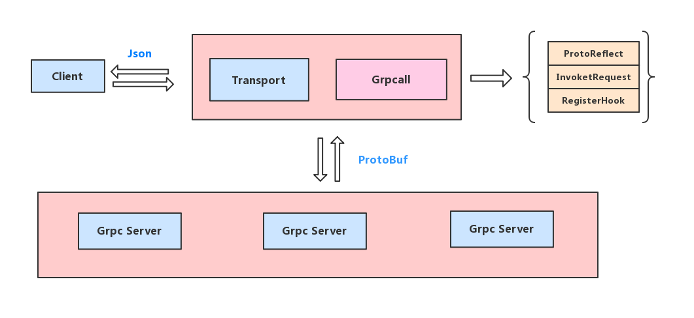

# grpcall

grpcall is a client library easy request GRPC Server with reflect mode. and easy make grpc proxy mode middleware, like grpc-gateway. 

use GRPC's reflect mode to request GRPC Server. grpcall support FileDescriptorSet and grpc/reflection mode.



`some code refer: protoreflect, grpcurl`

## Feature

* dynamic request GRPC Server with reflect mode. 
* dynamic convert protobuf to json and json to protobuf
* grpc client manager
* support stream
* recv system signal to update new descriptor.
* ...

## Usage

```go
grpcall.SetProtoSetFiles("testing/helloworld.protoset")
grpcall.InitDescSource()

var handler = DefaultEventHandler{}
var sendBody string

grpcEnter, err := grpcall.New(&handler)
grpcEnter.Init()

sendBody = `{"name": "hello"}`
err = grpcEnter.Call("127.0.0.1:50051", "helloworld.Greeter", "SayHello", sendBody)
fmt.Println("return err: ", err)

sendBody = `{"msg": "hello"}`
err = grpcEnter.Call("127.0.0.1:50051", "helloworld.SimpleService", "SimpleRPC", sendBody)
fmt.Println("return err: ", err)

```

## Test Example

1. start grpc server

```
cd testing; go run test_server.go
```

2. start grpcall client

```
cd testing; go run test_grpcall_client.go
```

## Protoset Files

Protoset files contain binary encoded `google.protobuf.FileDescriptorSet` protos. To create
a protoset file, invoke `protoc` with the `*.proto` files that define the service:

```shell
protoc --proto_path=. \
    --descriptor_set_out=myservice.protoset \
    --include_imports \
    my/custom/server/service.proto
```
